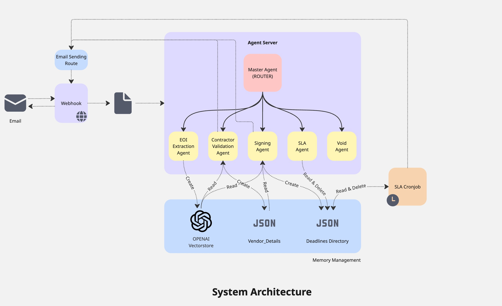

# starplan-hackathon
# OneCorp Contract Automation System

Automated EOI Extraction • Contract Validation • Signing Workflow • SLA Monitoring

This repository contains the full automation pipeline used by **OneCorp Australia** to manage property contract workflows using email-driven AI agents.  
The system integrates with Microsoft Outlook (Graph API), OpenAI (Responses + Vector Stores), LangGraph, and DocuSign notifications to fully automate the contract lifecycle.

---

## 🏗️ Architecture

The system consists of four independent agents coordinated by a central Master Router Agent. Each agent is stateless individually, but the platform maintains workflow continuity using a vector store, vendor directory, and deadline tracking.

## 🤖 Overview Of Agents

The platform uses four specialised agents, each triggered by specific incoming emails.
Agents operate within a stateful global workflow powered by vector search and persistent metadata.

### 1. EOI Extraction Agent
🔥 **When it triggers**
- When the system detects an incoming Expression of Interest email containing a PDF attachment.

🧠 **What it does**
- Converts PDF → structured JSON using GPT-4.1 & schema validation. 
- Extracts:
    1. Purchaser details
    2. Address + project information
    3. Pricing breakdown
    4. Solicitor details
    5. Finance terms
- Uploads the extracted JSON to an OpenAI Vector Store, enabling long-term memory for the workflow.
- Records vendor email → property address mapping.

🏁 **Output**
- A clean, validated EOI JSON stored and made searchable.

---

### 2. Contract Checker Agent
🔥 **When it triggers**
- When the system receives a Contract of Sale PDF from a vendor or solicitor.

🧠 **What it does**
- Retrieves the authoritative EOI JSON via vector store.
- Performs field-by-field validation::
    1. Purchasers
    2. Prices
    3. Lot/address
    4. Finance terms
    5. Solicitor details
- Detects:
    1. Price mismatches
    2. Incorrect purchasers
    3. Subtle finance clause conflicts
    4. Wrong addresses or solicitor details
- Records vendor email → property address mapping.

📤 **Automatic Emailing**
- If contract is valid → Email solicitor
- If mismatches exist → Email vendor + internal team with detailed discrepancy report.

🏁 **Output**
- Sends next-step actions to the correct stakeholders.

---

### 3. Signing Appointment Agent
🔥 **When it triggers**
- When a solicitor emails about booking a signing appointment.

🧠 **What it does**
- Extracts natural-language date/time (e.g., "Thursday 11:30am", "this Friday") 
- Calculates:
    1. Appointment datetime
    2. Reminder datetime (appointment + 2 days @ 9am)
    3. Saves reminder metadata to:
        ```bash
        /agents/deadlines/<Property_Address>.json
        ```

🏁 **Output**
- A future automated SLA reminder + vendor notification to release the contract.

---

### 4. SLA Completion Agent
🔥 **When it triggers**
- On receiving DocuSign signing events:
    - Buyer signed
    - Fully executed contract available

🧠 **What it does**
- Extracts the property address from the DocuSign email.
- Matches it to existing /deadlines/*.json.
- Deletes the deadline to mark the workflow as complete (no further reminders needed).

🏁 **Output**
- Removes SLA tracking and prevents unnecessary alerts.
---
## ⏱️ Deadline Monitoring
- **Signing Agent** creates a deadline file containing the signing appointment and a follow-up reminder (+2 days at 9:00 AM).
- **SLA Agent removes the file** automatically when DocuSign confirms buyer or full execution, ending the workflow.
- **Daily cronjob at 9:00 AM AEDT** scans remaining files; if a reminder date matches today, it sends an internal escalation email and deletes the file.
___
## ⚡ Platform Capabilities
- **Async Webhook Processing**: FastAPI + Microsoft Graph ensure instant, non-blocking email ingestion.

- **Multi-Workflow Scalability**: Handles multiple property contracts in parallel without interference.

- **Stateful Continuity**: Vector memory + JSON deadlines retain context across days.

- **Resilient & Secure**: OAuth token refresh, deduplication, and attachment streaming natively via Graph API

## 🏛 Repository Structure
```bash
starplan-hackathon/
│
├── agents/
│ ├── contract_checker_agent.py
│ ├── convert_document.py
│ ├── eoi_extraction_agent.py
│ ├── master_agent.py
│ ├── search_vs.py
│ ├── signing_agent.py
│ ├── sla_agent.py
│ ├── sla_cronjob.py
│ ├── vendor_details.json
│ ├── vendor.py
│ └── data/
│ └── deadlines/
│
├── mail_monitoring/
│ ├── .env
│ ├── login_app.py
│ ├── webhook.py
│ ├── convert_document.py
│ ├── azure_app_setup.md
│ └── ngrok_setup.md
│
├── data/
│
├── .env
├── README.md
├── requirements.txt
└── pyproject.toml
```

# 🚀 Setup Instructions
## 1. Initialize Project
```bash
uv init
```

## 2. Create Virtual Environment
```bash
uv venv
```

## 3. Activate Virtual Environment  
**macOS**
```bash
source .venv/bin/activate
```

**Windows**
```bash
.\.venv\Scripts\activate
```

## 4. Install Dependencies
```bash
uv add -r requirements.txt
```

## 5. Create `.env` File
Run the following command (replace placeholders):

```bash
echo "OPENAI_API_KEY=YOUR_OPENAI_API_KEY_HERE" > .env
```

## 6. Create Vectorstore on OpenAI
```bash
python setup/create_vectorstore.py
```

## 5. Update `.env` File
Get the VectorStore ID and run this command:

```bash
echo "OPENAI_API_KEY=YOUR_OPENAI_API_KEY_HERE
OPENAI_VS_ID=YOUR_OPENAI_VECTORSTORE_ID_HERE" > .env
```
## 6. Go to mail_monitoring and follow enclosing readne instructions

## 7. Start the Langraph Agent Server With following commands
```bash
cd agents
uvicorn server:app --reload --port 2000
```

## 7. Start the SLA cronjob With following commands
```bash
cd agents
crontab -e
0 9 * * * /usr/bin/python3 /PATH_TO_YOUR_REPOSITORY/agents/sla_cronjob.py >> /PATH_TO_YOUR_REPOSITORY/starplan-hackathon/logs/sla.log 2>&1

```